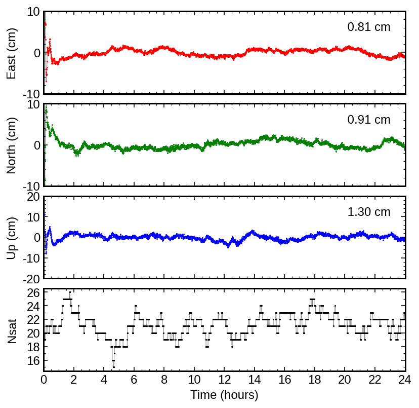
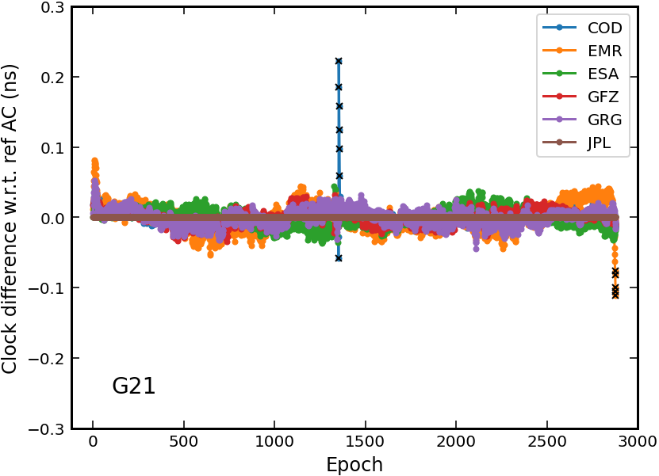

# PPPx_bin

Executables for the PPPx software package

> This test version was built for Linux users only

# PPPx

A software package not only for multi-GNSS Precise Point Positioning

## ppp
- Support GPS/GLONASS/Beidou-2+3/Galileo/QZSS
- Flexible frequency selection (L1/L2/L5/...)
- High-precision yet computation efficient
- Dual-frequency Ionosphere-free combination
- Ambiguity Resolution not implemented yet

## clkcomb
- Support multi-GNSS clock products combination & comparison
- Support phase bias products combination for PPP-AR

# Module: ppp

## Usage

1. Download precise satellite products: sp3+clk+erp+[obx]

> Nominal satellite attitude will be used if there is no `obx` product

> `erp` product should contain at least 3 days' records (for interpolation)

2. Modify the configuration file `ppp.ini`
    - session time
    - GNSS constellations
    - model & solver settings
    - path to products
    - path to tables

3. Run the command

```
./bin/ppp path-to-rinexobs ppp.ini -v
```

> Note: initial position should be provided in the RINEX-OBS header

> You can exclude problematic satellites in `ppp.ini` accroding to postfit residuals (visualization with rtkplot)

4. Visualization

- Option 1: python script

```
./scripts/plot_ppppos.py .pos_file -s
```

- Option 2: rtkplot (RTKLIB)

Simply drag the generated .stat file to the GUI of rtkplot

## Example

```
cd example/ppp/
./test.sh   # processing & plotting
```

**Kinematic PPP using GEC data for ZIM2 on 2022-100**


# Module: clkcomb

## Usage

1. Download IGS products for each AC: sp3+clk+[bia]+[obx]

> Two days' sp3 products needed (day & day+1)

2. Modify the configuration file `comb.ini`
    - session time
    - GNSS constellations
    - path to AC products
    - ...

3. Run the command

```
./bin/clkcomb comb.ini
```

4. Visualization

```
./scripts/plot_clkdif.sh dif_file log_file
```

## Example

```
cd example/clkcomb/
./test.sh   # combination & plotting
```

> More details about clock combination can be found [here](https://kns.cnki.net/kcms2/article/abstract?v=3uoqIhG8C475KOm_zrgu4lQARvep2SAkueNJRSNVX-zc5TVHKmDNkiyKUgpBK9S_sCjqwb0zPysJ1gG-vf0zC0an8zTeSCpr&uniplatform=NZKPT&src=copy)

**Clock comparison for G21 on 2022-001**


# Note

- The binary was built with gcc 11.3.0 on Ubuntu 22.04
- Please create an issue if you encounter any issues related to the software

# Contact

yxpan.im@gmail.com
