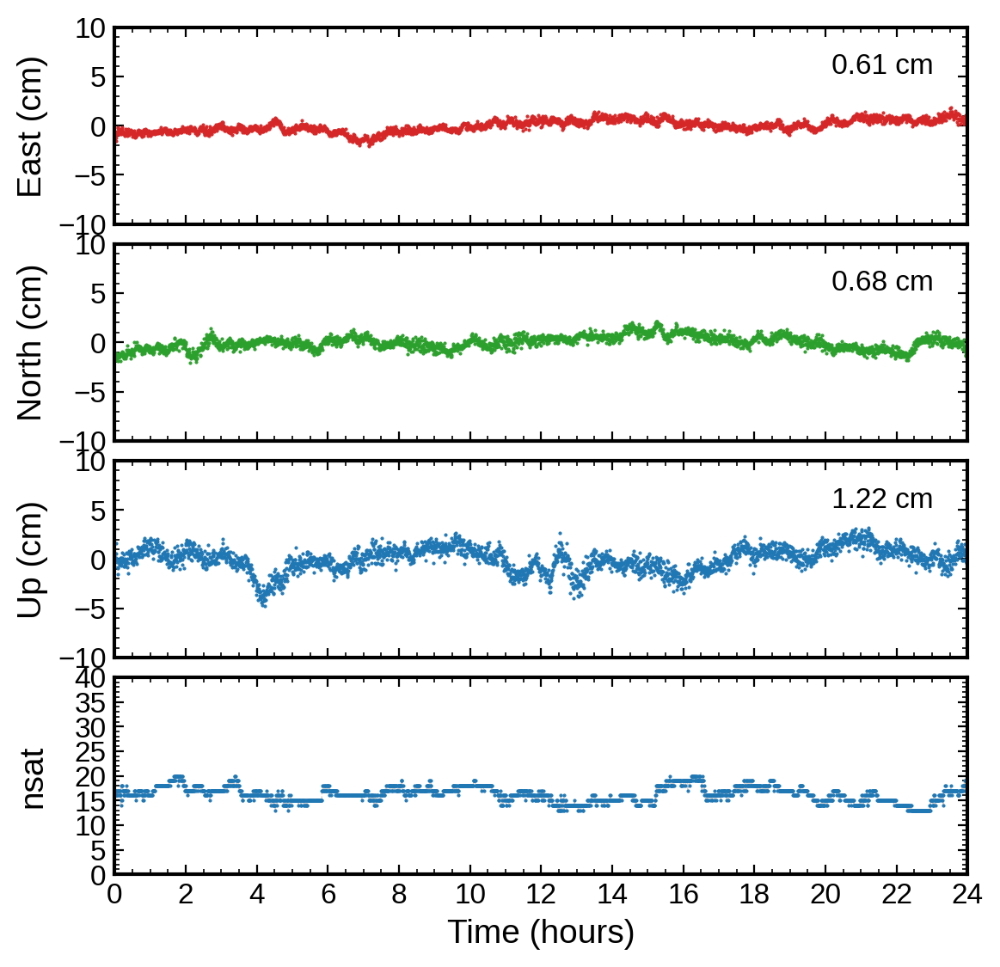

[](#)


# PPPx\_bin

PPPx is a versatile multi-GNSS data processing software package. Its capabilities
go beyond Precise Point Positioning (PPP).

The main program, `pppx`, focuses on positioning and supports the following features:
- Solution modes:
    - SPP: Single Point Positioning
    - PPP: Precise Point Positioning
    - RTK: short baseline processing
    - TDP: Time-Differenced Positioning
- GNSS systems: GPS, GLONASS, Galileo, Beidou-2/3, QZSS
- Solvers: LSQ, EKF and FGO
- PPP-AR with OSB products (.BIA)
- Flexible frequency selection: L1/L2/L5/E1/E5a/...
- High precision and efficiency: Capable of processing 2880 epochs within 2 seconds
- Unified input/output format
- Support Linux, Windows, and macOS

Other program(s) in the PPPx software package include:
- [clkcomb](https://github.com/YuanxinPan/clkcomb): A program for combining PPP-AR products


## Table of Contents
- [Installation](#installation)
    - [Linux](#linux)
    - [Windows](#windows)
    - [macOS](#macos)
- [Usage](#usage)
- [Example](#example)
- [Contributing](#contributing)


## Installation

### Linux

It is recommendeded to run `pppx` on Ubuntu or Debian, as the binary was built
with gcc 11 on Ubuntu 22.04. However, it should work on most modern Linux systems.
One limitation is that `pppx` uses the [ceres solver](http://ceres-solver.org)
library to implement the FGO solver, and thus `libceres-dev` (version == 2.x.x)
must be installed first. Currently, Ubuntu 20.04 and earlier versions only provide
`libceres-dev 1.x.x`, which is not compatible.


#### Option 1: With `libceres-dev`

The installation can be done with the following commands:

```shell
sudo apt install libceres-dev
git clone git@github.com:YuanxinPan/PPPx_bin.git

mkdir -p ${HOME}/.local/bin
cp PPPx_bin/bin/linux/pppx ${HOME}/.local/bin/
echo "export PATH=\${HOME}/.local/bin:\$PATH" >> ${ HOME}/.bashrc
# Restart your terminal afterward
```


#### Option 2: With `.deb` file

Download the `.deb` file from the latest [release](https://github.com/YuanxinPan/PPPx_bin/releases/).
Then run the following command to install the software:

```shell
sudo dpkg -i pppx_1.2.4_amb64.deb
```

The software and its dependencies will be installed in the `/opt/pppx/` directory.
A symbolic link to the `pppx` execultable will be created in `/usr/local/bin/`,
allowing you to invoke `pppx` from any directory in the terminal.


### Windows

The easiest way to run `pppx` on Windows is via the Windows Subsystem for Linux (WSL).

However, `pppx` can also run natively on Windows using the command prompt (cmd.exe):
1. Download DLLs via this [link](https://github.com/YuanxinPan/PPPx_bin/releases/download/v1.2.1/pppx_winows_dlls.zip)
2. Uncompress the zip file and move the DLLs to the folder `bin/windows/`
3. Add the absolute path of the folder `bin/windows` to the PATH environment variable
4. Open `cmd.exe` and type `pppx.exe ` to test if it is correctly installed


### macOS

If you do not have [Homebrew](https://brew.sh/) on your Mac, please install it first.
Then run the following commands via the Terminal application:

```shell
# Install or update ceres-solver
brew install ceres-solver

# Install pppx
git clone git@github.com:YuanxinPan/PPPx_bin.git
sudo mkdir -p /usr/local/bin/
sudo cp PPPx_bin/bin/macos/pppx /usr/local/bin/

# Check if the installation is successful
# If it fails, try to update ceres-solver
pppx
```

Due to Apple's security settings, you might need to authorize the `pppx` software:
[Open a Mac app from an unknown developer](https://support.apple.com/guide/mac-help/open-a-mac-app-from-an-unknown-developer-mh40616/mac)

> Note that `pppx` only supports Macs with Apple silicon and an OS version higher than Monterey


## Usage

The general steps to process GNSS data with `pppx` are:
1. Prepare RINEX observation files and necessary products (either broadcast ephemeris or precise products)
2. Modify an existing configuration file `pppx.ini`, or create a template ini file:

```shell
pppx -x ppp > pppx.ini  # ppp can be replaced with spp/rtk/tdp
```

3. Execute `pppx` with appropriate command-line arguments:

```shell
pppx -c pppx.ini path-to-rnxo [rnxo-of-base]

# Example usage:

# For SPP/PPP/TDP  (Note: TDP is suitable for high-frequency data, e.g., 1 Hz)
pppx -c pppx.ini rinex/ZIM200CHE_R_20221000000_01D_30S_MO.rnx

# For RTK (ZIMM is the base station in this example)
pppx -c pppx.ini rinex/ZIM200CHE_R_20221000000_01D_30S_MO.rnx rinex/ZIMM00CHE_R_20221000000_01D_30S_MO.rnx
```

To make GNSS data processing easier, the script `scripts/pppx.sh` is provided to
automatically download necessary products (e.g., SP3, CLK, OBX, BIA, ERP, BRDC, GIM, VMF1)
according to the configuration and invoke `pppx` afterwards. Currently, it only
supports the operational products from [CODE](http://ftp.aiub.unibe.ch/CODE/).
The recommended steps to use this wrapper script:

```shell
# Generate a default config file
pppx -x ppp > pppx.ini   # options: spp/ppp/rtk/tdp

# Edit pppx.ini if necessary but keep [product] (except "src") and [table] blank
pppx.sh -c pppx.ini rinex/ZIM200CHE_R_20221000000_01D_30S_MO.rnx
```

> **NOTE**: `scripts/pppx.sh` should be manually edited and the variable
"TABLE\_DIR" (line #42) should be set to the actual "table" folder of the
pppx software package before first use.


### Input

1. Configuration file: [pppx.ini](pppx.ini)
2. GNSS observations: RINEX files
3. Satellite products: Broadcast ephemeris or precise products, specified in `pppx.ini`
4. Table files: Provided in the [table](table/) directory, specified in `pppx.ini`


### Output

1. `pos file`: Receiver position, clock, and ZTD estimates for each epoch
2. `log file`: Debugging information
3. `stat file`: Postfit residuals and various estimates in the RTKLIB stat format, for visualization with [RTKLIB](https://github.com/tomojitakasu/RTKLIB_bin/tree/rtklib_2.4.3)


### Visualization

#### With Python

```shell
# To plot position estimates only
python scripts/plot_ppppos.py pos_file

# To plot position, receiver clock and ZTD estimates
python scripts/plot_ppppos.py pos_file -a

# -a  Plot receiver position, clock, and ZTD estimates
# -i  Interactive mode
# -s  Fixed scale for the y-axis; otherwise, scale is set automatically
```

#### With RTKLIB

For enhanced interactive viewing and visualization of postfit residuals:

1. Open the `rtkplot.exe` application
2. Navigate to "File" > "Open Solution-1" and select the generated stat file
3. Interactively view various plots


## Example

To help you get started, several examples are available in the
[example/pppx](example/pppx) folder. Additionally, an example demonstrating
`pppx` processing of GNSS data collected by Android smartphones is provided in
the [example/smartphone](example/smartphone) folder. Please execute the
correspoding `run.sh` script to see how `pppx` works:

```shell
cd example/pppx/
./run.sh   # processing & plotting
```

For instance, the following is a visualization of a kinematic PPP solution for
the ZIM2 station, using FGO and GPS+Galileo observations:




## Contributing

If you have suggestions or encounter issues related to the usage of the PPPx
software, please create an [issue](https://github.com/YuanxinPan/PPPx_bin/issues/new).


## Author

- **Yuanxin Pan** - [YuanxinPan](https://github.com/YuanxinPan)


## License

This project is licensed under the GPLv3 License - see the [LICENSE](LICENSE)
file for details.
