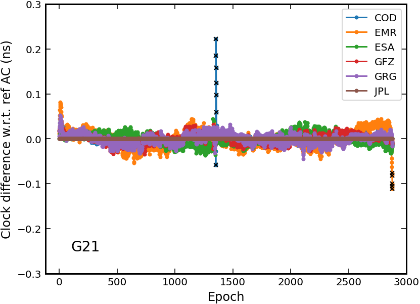

## Introduction

`clkcomb` is a program designed to combine PPP-AR products (satellite clock + phase bias) and legacy IGS clocks

- Support multi-GNSS clock products combination
- Support phase bias products combination for PPP-AR


## Usage

1. Download IGS products for each AC: sp3 + clk + [bia] + [obx]

> The sp3 of the second day will be needed if the 24:00 epoch is not included in the sp3 of current day

2. Modify the configuration file [comb.ini](comb.ini)
    - session time
    - GNSS constellations
    - path to AC products
    - ...

3. Execute the program

```shell
./bin/clkcomb comb.ini
```

4. Visualization

```shell
./scripts/plot_clkdif.sh dif_file log_file
```


## Example

```shell
cd example/clkcomb/
./run.sh   # combination & plotting
```

> More details about satellite clock & bias combination can be found [here](https://doi.org/10.27379/d.cnki.gwhdu.2021.000240)

**Clock comparison for G21 on 2022-001**



