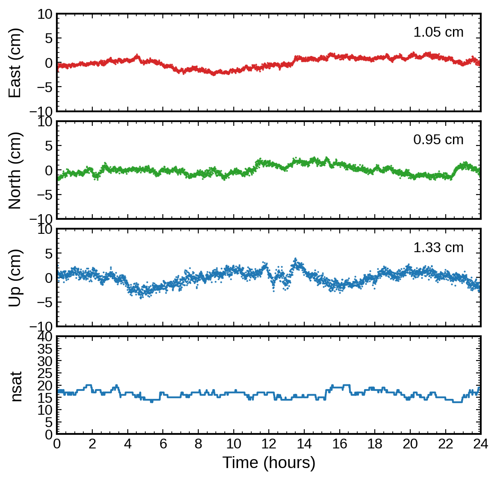

## Introduction

`pppx` is the program dedicated to positioning:
- Support four solution modes
    - SPP: Single Point Positioning
    - PPP: Precise Point Positioning
    - RTK: short baseline processing
    - TDP: Time-Differenced Positioning
- Support GPS/GLONASS/Beidou-2+3/Galileo/QZSS
- Flexible frequency selection (L1/L2/L5/...)
- High-precision yet computation efficient
- Unified input/output format


## Usage

The general way to execute `pppx` is:

```shell
pppx path-to-rnxobs [rnxobs-of-base] pppx.ini

# For example

# PPP
pppx rinex/ZIM200CHE_R_20221000000_01D_30S_MO.rnx pppx.ini

# RTK
# ZIMM will be the base station in this way
pppx rinex/ZIM200CHE_R_20221000000_01D_30S_MO.rnx rinex/ZIMM00CHE_R_20221000000_01D_30S_MO.rnx pppx.ini

```


### Input

0. Configuration file: `pppx.ini`
1. GNSS observations in RINEX format, specified by command line arguments
2. Satellite products (option: brdc or precise), specified by `pppx.ini`
    - brdc: (broadcast ephemeris)[https://cddis.nasa.gov/archive/gnss/data/daily/2024/brdc/]. Note: RINEX-4 is not supported yet
    - precise: IGS satellite orbit, clock and attitude (optional) [products](https://cddis.nasa.gov/archive/gnss/products/)
3. Table files (already provided in the `table/` directory, specified by `pppx.ini`)


### Output

0. `pos` file: Receiver position, clock and ZTD estimates for every epoch
1. `log` file: Information for debugging
2. `stat` file: Postfit residuals and various estimates in the RTKLIB stat format, dedicated to visualization with [rtkplot](https://github.com/tomojitakasu/RTKLIB_bin/tree/rtklib_2.4.3)


### Processing

0. Prepare RINEX observation files and necessary products (either brdc or precise)
1. Modify the configuration file `pppx.ini`
2. Execute `pppx` with correct command line arguments


#### Configuration

Most settings inside `pppx.ini` is self-explained. Usually, users need to modify the following settings:
- [session]: date
- [constellation]: system
- [solver]: sol\_mode, pos\_mode, solver
- [product]: src, nav, sp3, clk
- [table]
- [output]

Although most settings are shared by different sol\_mode (i.e., spp/ppp/rtk/tdp), some settings are sol\_mode specific:
- [model]: trop, iono => not effective for rtk. Tropospheric and ionospheric delays are ignored for short baseline
- [solver]: slip\_det => only effective for ppp. rtk and tdp always use LLI and GF to detect cycle slips
- [solver]: pos\_pri, clk\_pri, isb\_pri, ztd\_pri => only effective for ppp


### Visualization

#### With python

```shell
# plot position estimates only
../../scripts/plot_ppppos.py .pos_file

# plot position, receiver clock and ZTD estimates
.././scripts/plot_ppppos.py .pos_file -a

# -i interactive mode
# -s fixed scale of y-axis, otherwise automatically scaled
```

#### With RTKLIB

Simply drag the `.stat` file to the GUI of [rtkplot](https://github.com/tomojitakasu/RTKLIB_bin/tree/rtklib_2.4.3)


## Example

An exmaple is provided for PPP processing:

```shell
cd example/pppx/
./run.sh   # processing & plotting
```

**FGO-based kinematic PPP for ZIM2 (GPS + Galileo)**




## Limitation

The current limitations:
- Not all the solvers are supported for each mode (spp/ppp/rtk/tdp)
- Only short baseline is supported for rtk
- Standard deviations of position estimates are not outputted when `ceres solver (fgo)` is used (quite time consuming)
